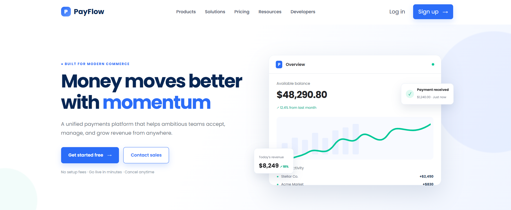
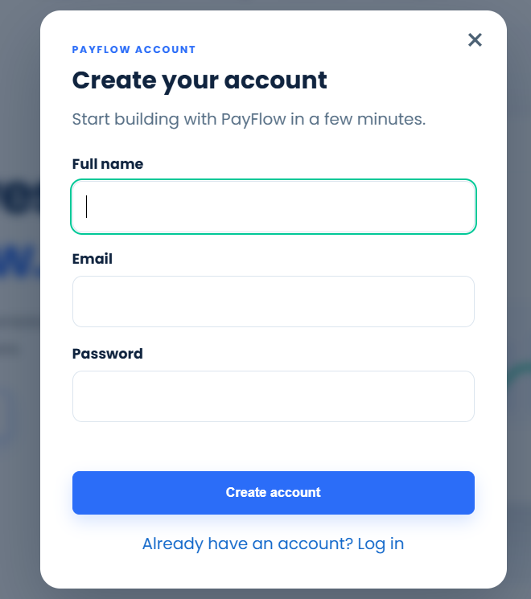

# 💳 PayFlow - Razorpay Inspired Payment Platform Clone

A modern and responsive payment platform website inspired by Razorpay, built using **HTML, CSS, JavaScript**, and a **Node.js backend** with authentication support.

## 🌐 Live Demo

🔗 razorpay-clone-weld-eight.vercel.app

## 📂 GitHub Repository

🔗 https://github.com/jaivincy/razorpay-clone

---

## 📸 Screenshots

### Home Page


### Login Page


### Signup Page


### Responsive Design

#### Tablet View


#### Mobile View


---

## ✨ Features

- Responsive Design
- Modern Razorpay Inspired UI
- Interactive Navigation
- Smooth Animations
- Login & Signup
- JWT Authentication
- Backend API Structure
- Swagger API Documentation
- Mobile Friendly Layout
- Organized Folder Structure

---

## 🛠 Tech Stack

### Frontend
- HTML5
- CSS3
- JavaScript

### Backend
- Node.js
- Express.js
- JWT Authentication
- PostgreSQL
- Supabase

### Tools
- Git
- GitHub
- Vercel

---

## 📁 Project Structure

```
payment-clone/
│
├── assets/
│   ├── images/
│   ├── icons/
│   └── illustrations/
│
├── css/
├── js/
├── backend/
│
├── index.html
└── README.md
```

---

## 🚀 Installation

### Clone Repository

```bash
git clone https://github.com/jaivincy/razorpay-clone.git
```

### Go to Project

```bash
cd payment-clone
```

### Backend

```bash
cd backend
npm install
npm start
```

### Frontend

Simply open

```
index.html
```

or use Live Server.

---

## 📌 Future Enhancements

- Razorpay Test Mode Integration
- Payment Success & Failure Pages
- Transaction History
- User Dashboard
- Email Notifications
- Download Payment Receipt
- Dark Mode

---

## 👨‍💻 Author

**Jaivincy V**

- GitHub: https://github.com/jaivincy
- LinkedIn: https://www.linkedin.com/in/jaivincy-v

---

## ⭐ Support

If you like this project, don't forget to **star** the repository.
